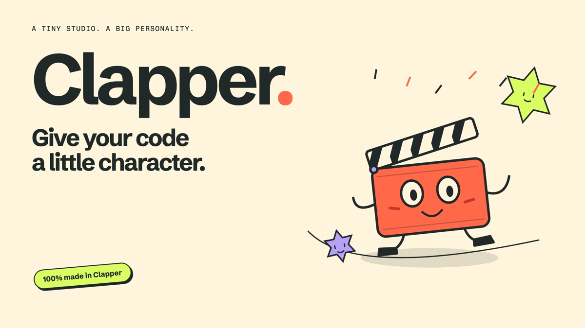

# Clapper

[](https://cdn.jsdelivr.net/gh/ArchAstro/clapper@f39d98581ce8eb3eb4455ecaca0b970570ab690c/docs/media/clapper-intro.mp4)

**[▶ Play the intro · 25 seconds · sound on](https://cdn.jsdelivr.net/gh/ArchAstro/clapper@f39d98581ce8eb3eb4455ecaca0b970570ab690c/docs/media/clapper-intro.mp4)** · [Video file](docs/media/clapper-intro.mp4) · [Source](videos/clapper-intro)

Install the skill for your coding agent:

```sh
npx skills add ArchAstro/clapper --skill clapper --global
```

Choose your agent when prompted, then start a new session and ask:

> Use the Clapper skill to make a video with original music. Set up everything needed.

The skill installs Clapper, prepares the runtime, creates the project, and guides visual/audio review. No separate Clapper setup is required.

If you don't have `npx`, ask your agent to install the skill from [skills/clapper](https://github.com/ArchAstro/clapper/tree/main/skills/clapper).

### Voice narration

Optional local speech with multiple locked narrator voices: see [Narration](docs/narration.md).
Run `clapper voices install` only when needed; model weights and the inference runtime
are not included in the default install.

### Technical-video evals (checkout)

The [evaluation suite](benchmarks/technical-video/README.md) runs frozen briefs,
real render/evidence collection, independent judgments and blind comparisons.
Use `node packages/cli/bin/clapper.mjs eval --help`. It never treats missing
observations as approval or claims learning gains from model-generated reviewers.
